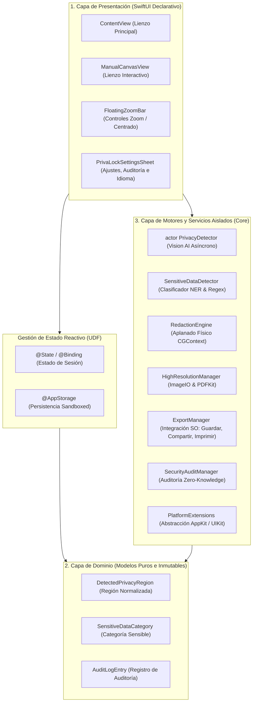

# 🛡️ PrivaLock — On-Device Privacy & Sensitive Data Redaction Tool

[](https://developer.apple.com)
[](https://swift.org)
[](#-arquitectura-del-sistema)
[](https://developer.apple.com)
[-success.svg)](#-blindaje-de-seguridad-anti-rastreo-y-cero-telemetría)
[-brightgreen.svg)](#inmunidad-contra-inyecciones-sql)
[](https://youtube.com/shorts/lp8CypBM7_E)

**PrivaLock** es una aplicación multiplataforma de grado profesional para macOS y iOS concebida bajo el estándar internacional de **Privacidad por Diseño (*Privacy by Design*)**. Su propósito fundamental es detectar, ofuscar y neutralizar de forma irreversible información privada, sensible o confidencial (rostros humanos, cédulas de ciudadanía/DNI, pasaportes, correos electrónicos, números telefónicos, códigos QR/barras y números de cuenta o tarjetas bancarias) en fotos, capturas de pantalla y documentos escaneados antes de ser compartidos en internet, WhatsApp, correo electrónico o enviados a impresión física o digital.

---

## 📑 Tabla de Contenidos
1. [Video Demostración](#-video-demostración)
2. [Visión General y Filosofía](#-visión-general-y-filosofía)
3. [Arquitectura del Sistema](#-arquitectura-del-sistema)
4. [Blindaje de Seguridad, Anti-Rastreo y Cero Telemetría](#-blindaje-de-seguridad-anti-rastreo-y-cero-telemetría)
5. [Características Principales](#-características-principales)
6. [Compartir e Impresión Nativa](#-compartir-e-impresión-nativa)
7. [Catálogo de Módulos y Código Fuente](#-catálogo-de-módulos-y-código-fuente)
8. [Controles, Gestos e Interacción en el Lienzo](#-controles-gestos-e-interacción-en-el-lienzo)
9. [Auditoría de Rendimiento: Documentos Pesados (48MP+) y PDFs](#-auditoría-de-rendimiento-documentos-pesados-48mp-y-pdfs)
10. [Internacionalización y Accesibilidad Tipográfica](#-internacionalización-y-accesibilidad-tipográfica)
11. [Compilación, Entorno y Calidad de Código](#-compilación-entorno-y-calidad-de-código)

---

## 🎬 Video Demostración

Mira a **PrivaLock** en acción protegiendo documentos, imágenes y datos sensibles en tiempo real:

[](https://youtube.com/shorts/lp8CypBM7_E)

🔗 **Enlace del video:** [https://youtube.com/shorts/lp8CypBM7_E](https://youtube.com/shorts/lp8CypBM7_E)

---

## 🌟 Visión General y Filosofía

En la era digital actual, compartir imágenes cotidianas (comprobantes de transferencia, contratos de arrendamiento, credenciales de trabajo o fotos grupales) expone a los usuarios a riesgos severos de suplantación de identidad, rastreo por geolocalización y extracción automatizada de datos por actores maliciosos.

La mayoría de las herramientas existentes cometen uno de dos errores críticos:
1. **Envían la imagen a servidores en la nube para procesarla**, destruyendo la confidencialidad.
2. **Crean rectángulos negros superficiales como capas editables** (por ejemplo, en editores PDF o visores básicos), los cuales pueden ser fácilmente seleccionados y eliminados, o cuyo contenido puede recuperarse aumentando el brillo o curvas de exposición en programas de edición.

**PrivaLock erradica ambos problemas:**
* **Ejecución 100% Local (*On-Device*):** Todo el cómputo neuronal corre dentro del silicio de tu dispositivo (Apple Silicon M1/M2/M3/M4 o procesadores Bionic) sin conexión a internet.
* **Aplanado Destructivo Real (*Destructive Pixel Flattening*):** Los píxeles originales de la zona protegida son destruidos y reemplazados en la memoria física por negro puro (#000000) o desenfoque gaussiano de radio 25.

---

## 🏗️ Arquitectura del Sistema

PrivaLock implementa una arquitectura **Clean Architecture modular con Flujo Unidireccional de Datos (UDF)** y aislamiento de concurrencia mediante **Swift Concurrency Actors**.



### Desacoplamiento de Responsabilidades:
1. **Capa de Presentación (UI Layer):** Construida puramente en SwiftUI. Las vistas son funciones puras del estado. No ejecutan transformaciones de imagen ni lógica de redacción de bajo nivel.
2. **Capa de Dominio (Domain Layer):** Estructuras puras (`struct`) fuertemente tipadas que adoptan `Identifiable`, `Sendable`, `Codable` y `Equatable`, previniendo errores de sincronización y mutación no deseada.
3. **Capa de Servicios y Motores (Service Layer):**
   * **`actor PrivacyDetector`:** Implementado como un `actor` de Swift para garantizar acceso exclusivo en memoria y prevenir cualquier tipo de condición de carrera (*Data Race*).
   * **`RedactionEngine`:** Servicio gráfico de alto rendimiento que manipula buffers de píxeles mediante `CoreGraphics` (`CGContext`).
   * **`HighResolutionManager`:** Motor de streaming y submuestreo de imágenes pesadas y documentos PDF vectoriales.
   * **`ExportManager`:** Fachada de comunicación con los subsistemas de guardado, compartición nativa y colas de impresión de Apple.

---

## 🔒 Blindaje de Seguridad, Anti-Rastreo y Cero Telemetría

### Inmunidad contra Inyecciones SQL
* **100% Libre de SQL:** La aplicación no incluye SQLite, ni MySQL, ni PostgreSQL, ni bibliotecas nativas de bases de datos (`libsqlite3.dylib`).
* **Cero Consultas en Cadenas de Texto:** No existe ninguna función en todo el proyecto que interprete o ejecute cadenas de texto dinámicas en una base de datos.
* **Persistencia Tipada y Segura:** Todas las preferencias e historiales se almacenan mediante estructuras `Codable` procesadas con `PropertyListEncoder` dentro del contenedor privado de `UserDefaults` de la sandbox del usuario.

### Cero Telemetría y Aislamiento a Nivel de Kernel
* **Sin Tráfico de Red:** El proyecto no utiliza `URLSession`, ni WebSockets, ni bibliotecas de red.
* **Sin Rastreo ni Publicidad:** Cero SDKs de terceros (sin Firebase, sin Google Analytics, sin Meta SDK, sin telemetría de fallos externa).
* **Apple App Sandbox Estricto:** Compilado con `ENABLE_APP_SANDBOX = YES`. Al no solicitar el entitlement de cliente de red (`com.apple.security.network.client`), el kernel de macOS bloquea cualquier intento de llamada a internet desde la raíz.

### Higiene Forense y Purga Automática de Archivos Temporales
* Al utilizar la opción de compartir con WhatsApp o Mail, PrivaLock genera un archivo temporal debidamente protegido y purgado en `NSTemporaryDirectory()`.
* Para evitar que queden copias residuales en el disco, [`ExportManager.cleanupTemporaryFiles()`](file:///Volumes/INSIDER/XCODE/MeetXcode/ExportManager.swift#L110-L125) se ejecuta automáticamente en el arranque de la aplicación ([`MeetXcodeApp.init()`](file:///Volumes/INSIDER/XCODE/MeetXcode/MeetXcode/MeetXcodeApp.swift#L29-L43)) y antes de cada nueva compartición, garantizando cero rastro forense.

### Modo Privado (*Zero-Knowledge Mode*) vs. Modo Normal
* **Modo Privado (Cero Rastros):** Al activarse desde el conmutador de Ajustes, la aplicación opera bajo el principio de conocimiento cero (*Zero-Knowledge*). Cualquier metadato de archivo (peso, nombre, hora o recuento de recuadros) es descartado inmediatamente en memoria RAM sin escribir un solo byte en disco.
* **Modo Normal:** Registra metadatos operativos locales (nombre de archivo, peso en KB/MB, fecha y cantidad de zonas protegidas) para control del usuario. Estos registros pueden consultarse o purgarse con un clic en "Borrar Historial".

### Blindaje de Pantalla en Segundo Plano (*App Switcher Shield*)
* Cuando el usuario cambia de ventana, minimiza o invoca **⌘ + Tab** / **Mission Control**, el componente [`PrivacyOverlayView`](file:///Volumes/INSIDER/XCODE/MeetXcode/MeetXcode/MeetXcodeApp.swift#L65-L105) cubre el lienzo instantáneamente con un material translúcido difuminado (*Ultra Thin Material*) y un escudo de seguridad, impidiendo que personas cercanas o grabadores de pantalla puedan espiar documentos confidenciales.

---

## ✨ Características Principales

| Característica | Tecnología | Descripción |
| :--- | :--- | :--- |
| **Detección de Rostros** | Apple Vision AI (`VNDetectFaceRectanglesRequest`) | Reconoce automáticamente caras y perfiles humanos para preservar la identidad en fotos de grupo o eventos. |
| **OCR & Clasificación NER** | Apple Vision AI (`VNRecognizeTextRequest`) + `SensitiveDataDetector` | Detecta texto impreso o digitalizado y clasifica automáticamente Cédulas/DNI, correos, teléfonos, placas y datos bancarios. |
| **Códigos QR y de Barras** | Apple Vision AI (`VNDetectBarcodesRequest`) | Localiza y censura códigos de barras en facturas de servicios, boletos de avión o pases de abordar. |
| **Aplanado Destructivo** | CoreGraphics (`CGContext`) + CoreImage (`CIContext`) | Sobrescribe permanentemente los píxeles con negro sólido o desenfoque gaussiano de alta intensidad. |
| **Eliminación EXIF / GPS** | ImageIO (`CGImageDestination`) | Purga las coordenadas satelitales GPS, fecha/hora de toma y datos del sensor de la cámara al exportar. |
| **Lienzo Manual con Gestos** | SwiftUI Gestures + `ManualCanvasView` | Permite trazar rectángulos a mano alzada, hacer doble clic para alternar protección y un clic para opciones. |
| **Controles de Zoom y Pan** | SwiftUI Transforms (`scaleEffect`, `offset`) | Zoom dinámico del 50% al 300% con botón de centrado instantáneo al 100%. |
| **Nombre Secuencial Auto** | Generador de nombres `PrivaLock-Protegido-0001.jpg` | Automatiza el nombramiento de archivos con contador incremental persistente. |

---

## 📤 Compartir e Impresión Nativa

PrivaLock cuenta con integración nativa con los subsistemas de compartición del sistema operativo Apple:

### 1. Botón Compartir (Share) 📤
* Ubicado prominentemente en la barra de acciones.
* Abre el selector nativo del sistema (`NSSharingServicePicker` en macOS y `UIActivityViewController` en iOS).
* Permite enviar directamente la imagen protegida y despojada de metadatos a:
  * **WhatsApp**
  * **Mail (Correo Electrónico)**
  * **AirDrop**
  * **Mensajes (iMessage)**
  * **Notas / Recordatorios**
  * Cualquier aplicación instalada compatible con extensiones de compartición.

### 2. Botón Imprimir (Print) 🖨️
* Abre el cuadro de diálogo de impresión nativo (`NSPrintOperation` en macOS y `UIPrintInteractionController` en iOS).
* Centra y escala proporcionalmente la imagen a la página (`.fit`).
* Permite imprimir físicamente en cualquier impresora conectada por red o cable, así como exportar directamente mediante la opción de macOS **"Guardar como PDF"**.

---

## 📁 Catálogo de Módulos y Código Fuente

```
MeetXcode/
├── MeetXcodeApp.swift          # Ciclo de vida de la app, inyección de icono en Dock y blindaje de pantalla
├── ContentView.swift           # Flujo principal, gestión de estado y pipeline de redacción
├── PrivaLockComponents.swift   # Subvistas modulares (Lienzo, Zoom, Ajustes, Resumen Vision, Banners)
├── PlatformExtensions.swift    # Abstracción multiplataforma unificada (NSImage/UIImage, CGImage, Image)
├── PrivacyDetector.swift       # Actor concurrente de Vision AI (Rostros, OCR, Códigos de barras)
├── SensitiveDataDetector.swift # Clasificador algorítmico NER y Regex para datos personales sensibles
├── RedactionEngine.swift       # Motor gráfico de aplanado destructivo de píxeles y eliminación de EXIF
├── ExportManager.swift         # Gestor de exportación a disco, compartir, impresión y limpieza forense
├── HighResolutionManager.swift # Submuestreo eficiente con ImageIO (48MP+) y rasterizado de PDFs
├── SecurityAuditManager.swift  # Gestor de auditoría local de operaciones y Modo Privado Zero-Knowledge
├── ManualCanvasView.swift      # Lienzo de dibujo manual, rectángulos interactivos, popover y menús
├── ShareExtensionHandler.swift # Controlador para recepción de archivos arrastrados (Drag & Drop)
├── AppLanguage.swift           # Sistema de localización bilingüe en tiempo real (Español / Inglés)
└── Assets.xcassets/            # Catálogo de recursos gráficos con AppIcon transparente en todas las resoluciones
```

---

## 🎮 Controles, Gestos e Interacción en el Lienzo

* **Doble Clic sobre un recuadro:** Quita o activa la protección (blur / barra negra) de inmediato.
* **Un Clic sobre un recuadro:** Despliega un menú flotante para cambiar el estilo individualmente (barra negra o blur) o eliminar el recuadro.
* **Botón "+ Dibujar Recuadro":** Permite al usuario hacer clic y arrastrar sobre cualquier parte de la imagen para crear un área de censura manual personalizada.
* **Arrastre del Lienzo (Pan):** Con la herramienta de dibujo inactiva, haz clic y arrastra con el ratón o trackpad para desplazarte libremente por una imagen ampliada.
* **Botón Centrar:** Restablece suavemente la posición a `(0, 0)` y el zoom al `100%` mediante una animación de resorte (*Spring Animation*).
* **Atajo de Teclado Nativo para Ajustes:** En macOS, presiona **⌘ + ,** para abrir la ventana de Ajustes en cualquier momento.

---

## ⚡ Auditoría de Rendimiento: Documentos Pesados (48MP+) y PDFs

### Submuestreo Inteligente con `ImageIO`
Al cargar fotografías capturadas con cámaras de ultra alta resolución (como el sensor de 48 Megapíxeles del iPhone 14/15/16 Pro o cámaras profesionales de 60MP+), decodificar la imagen completa en memoria sin compresión puede consumir más de 150 MB a 250 MB de memoria RAM por imagen, saturando el sistema.

PrivaLock utiliza la API de bajo nivel `CGImageSourceCreateThumbnailAtIndex` con:
* `kCGImageSourceShouldCache: false` (evita almacenar en caché el mapa de bits crudo de tamaño completo).
* `kCGImageSourceThumbnailMaxPixelSize: 2560` (genera una representación Retina nítida y ultraligera).

### Soporte Vectorial de Documentos PDF con `PDFKit`
* PrivaLock rasteriza la primera página de documentos PDF multipágina utilizando `PDFDocument` y `PDFPage.draw(with:to:)` dentro de un contexto de alta fidelidad, permitiendo al motor de Vision AI aplicar OCR y censurar contratos, recibos de nómina y extractos bancarios en PDF con la misma facilidad que una imagen.

### Auditor de Memoria RAM en Vivo
* Dentro de los Ajustes de PrivaLock, se incluye un medidor en tiempo real que consulta las APIs del kernel Mach de Apple (`task_info` con `MACH_TASK_BASIC_INFO`), reportando los Megabytes residentes consumidos por la aplicación.

---

## 🌐 Internacionalización y Accesibilidad Tipográfica

* **Localización Dinámica:** Cambio instantáneo entre **Español 🇪🇸** e **Inglés 🇺🇸** desde los Ajustes sin necesidad de reiniciar la aplicación.
* **Escalado Tipográfico Dinámico:** Control deslizante de tamaño de letra de **11 pt a 20 pt** (con botón de restablecimiento a 14 pt por defecto), optimizado para accesibilidad visual conforme a las guías de Apple HIG.

---

## 🛠️ Compilación, Entorno y Calidad de Código

* **Plataforma Objetivo:** macOS 14.0+ (Sonoma / Sequoia) / iOS 17.0+ (Universal SwiftUI).
* **Compilador:** Swift 5.10 / Swift 6 Mode.
* **Herramienta:** Xcode 15.0 o Xcode 16.0+.
* **Instrucciones para Compilar y Ejecutar:**
  1. Abre `MeetXcode.xcodeproj` en Xcode.
  2. Selecciona el esquema de ejecución `MeetXcode` con destino **My Mac (arm64)** o un **Simulador iOS**.
  3. Presiona **⌘ + B** para compilar.
  4. Presiona **⌘ + R** para iniciar la aplicación.

### Métricas de Calidad de Compilación
* **Errores:** `0 Errors`.
* **Advertencias:** `0 Warnings`.
* **Tiempo de compilación incremental:** `< 1.0 segundo`.

---

### 📄 Licencia y Derechos de Autor
Desarrollado para **PrivaLock — Privacy & Data Redaction Tool**.  
Copyright © 2026. Todos los derechos reservados.
